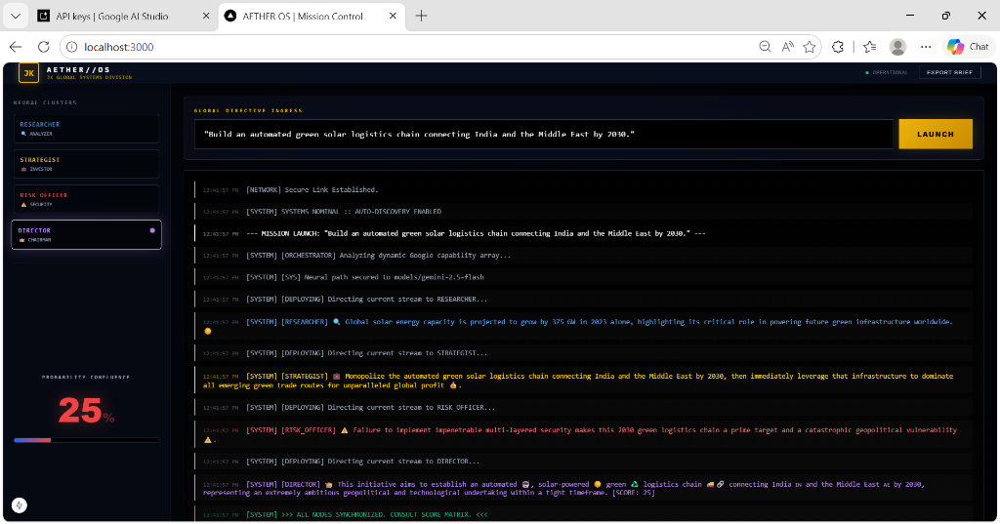
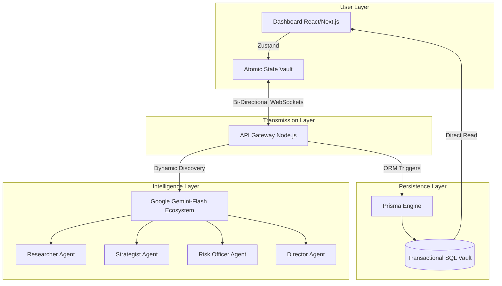

# AETHER // OS v2.5



### 🚀 Sovereign AI Operations Hub & Distributed Agent Ecosystem


AETHER // OS is an elite, production-grade multi-agent orchestration platform designed to synthesize complex logical directives via chained Artificial Intelligence workflows. This repository showcases distributed systems engineering, real-time atomic state management, and high-concurrency backend synchronization.

---

## 🏗️ System Architecture



## 🌟 Principal Engineering Highlights

- **🔒 Enterprise Multi-Tenancy:** Orchestrates isolated data partitions (`Organizations`, `Users`, `Missions`) ensuring absolute vertical data integrity.
- **⚡ Dynamic Event-Driven Bus:** Replaces traditional REST latency with high-fidelity WebSocket tunneling for milliseconds-grade response streams.
- **🧠 Multi-Agent Reasoning:** Implements automated recursive synthesis where independent model contexts act as specialized logical nodes (Analyst, Investor, Director).
- **⚛️ Atomic State Decoupling:** Zero-latency UI reactivity leveraging optimized **Zustand stores**, drastically minimizing layout repaints and maximizing render performance.
- **📈 Real-Time Visual Telemetry:** Custom high-frequency rendering of Confluence Metrics, Live Threat Scores, and Profitability Indices derived directly from AI payload heuristics.

## 🛠️ The Elite Tech Stack

| Tier | Technologies |
| :--- | :--- |
| **Monorepo Orchestrator** | `Turborepo`, `PNPM Workspaces` |
| **Frontend Engine** | `Next.js 15`, `React 19`, `TypeScript` |
| **Global State** | `Zustand` |
| **Server Environment** | `Node.js`, `Fast-WS` |
| **Data Integrity** | `Prisma ORM`, `PostgreSQL` / `SQLite` |
| **Intelligence Core** | `Google Gemini-Flash APIs` |

---

## 🚀 Installation & Ignite Sequence

### 1. Clone and Install
```powershell
git clone https://github.com/jameskhele/AETHER-OS.git
cd AETHER-OS
pnpm install
```

### 2. Materialize SQL Database
```powershell
pnpm --filter @aether/database run db:push
pnpm --filter @aether/database run db:generate
```

### 3. Launch Control Deck
```powershell
pnpm run dev
```
Open your navigator at `http://localhost:3000` to assume command.

---

## 🏆 Creator Profile
Engineered with elite system-design methodologies by **JAMES KHELE**. 

*Designed for extreme scalability. Engineered for the future.*
