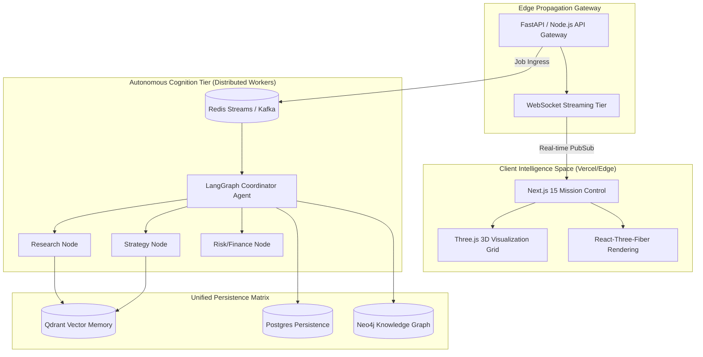

# 💠 AETHER OS

## Autonomous Multi-Agent Intelligence Operating System for Real-Time Decision Simulation

[](https://github.com/jameskhele/AETHER-OS)
[](https://turbo.build/)
[](https://github.com/jameskhele/AETHER-OS)

**AETHER OS** is an enterprise-grade, distributed intelligence hub engineered to simulate autonomous collaborative decision environments. Designed specifically as a high-load, multi-agent command and control platform, it aggregates global data streams and facilitates real-time logical debate between specialized autonomous entities.

> *Think NASA Mission Control meets distributed, hyper-scalable Agentic reasoning.*

---

### 🧠 The Core Concept (In 30 Seconds)
AETHER OS acts as a **Centralized Walkie-Talkie War Room**. Instead of interacting with a single static chatbot, users issue high-level directives to a "Mission Deck." 

The operating system automatically deploys, orchestrates, and mediates a **Team of Specialized AI Agents** (Researcher, Strategist, Risk Officer) who collaborate in real-time over a unified streaming fabric to produce rapid, vetted intelligence.

---

## 🏗️ Master Architecture Outline

Aether OS runs as a federated network of cognitive services organized within an event-driven, streaming-first infrastructure.



---

## 🚀 Elite Features Matrix

### 1. Real-Time Multi-Agent Orchestration
Leveraging `LangGraph` and specialized semantic routers, deployed agents formulate hypotheses, counter-argue, and arrive at emergent decision trees dynamically.

### 2. Vector-Space Semantic Continuity
A distributed long-term memory structure enabling agents to inherit historical intelligence vectors asynchronously, optimized via `Qdrant`.

### 3. The 'Mission Control' Dash
A high-density reactive terminal written in **Next.js 15 + Framer Motion** designed to show glowing real-time graphs of agent interaction, thought logs, and system health.

### 4. Scalable Infrastructure as Code
Engineered to be deployed across hybrid clusters utilizing standard **Docker Compose** orchestrations and cloud-agnostic deployment pathways.

---

## 🛠️ High-Efficiency Tech Core

| Tier | Technologies |
| :--- | :--- |
| **Frontend Platform** | Next.js 15, React 19, Tailwind, Framer Motion, Three.js |
| **AI Orchestration** | LangGraph, OpenAI SDK v4, Claude-3.5, DeepSeek-R1 |
| **Backend Logic** | FastAPI (Python 3.11+), pydantic v2, asynchronous runtimes |
| **Data Pipelines** | Redis Streams, WebSockets, Postgres, Qdrant Cloud |
| **Infrastructure** | Docker, GitHub Actions CI/CD, Terraform, Turborepo |

---

## 📂 Domain Domain Hierarchy (Monorepo)

```text
AETHER-OS/
├── apps/
│   ├── web/                   # Next.js 15 Main Mission Control Dashboard
│   └── docs/                  # Internal engineering design docs
├── services/
│   ├── api-gateway/           # Ingress traffic orchestrator
│   └── ai-orchestrator/       # LangGraph agent runtimes & workflows
├── infrastructure/
│   ├── docker/                # Multi-container configurations
│   └── k8s/                   # Kubernetes manifests (Planned)
├── ai/
│   ├── agents/                # Definition matrix for customized Persona agents
│   └── memory/                # RAG/Embedding pipelines
└── packages/
    ├── ui/                    # Shared shadcn/ui design system
    └── configs/               # Centralized ESLint/Prettier/TSConfig
```

---

## 🏁 Roadmap to Genesis

### 📍 Phase 1: Foundations (COMPLETED ✅)
- [x] Establish Master Monorepo Hierarchy (Turborepo Skeleton).
- [x] Define Global System Design and Architecture Diagrams.
- [x] Set Infrastructure Docker scaffolding.

### 📍 Phase 2: Front-End Kinetic Design (COMPLETED ✅)
- [x] Setup Next.js 15 app routing and design tokens.
- [x] Establish secure UI layer components.
- [x] Live WebSocket bridge negotiation.

### 📍 Phase 3: Autonomous Brain Nodes
- Deploy basic Research/Executive agent logic using LangGraph.
- Connect vector store for basic recall.
- Implement tool calling (Google Search/Finance API mocks).

---

## ⚖️ Contributing & Governance

This represents an aggressive, long-horizon development pipeline.
Review the `CONTRIBUTING.md` for governance concerning semantic commit enforcement and pipeline validation rules.

*Project curated and pioneered by James Khele @ 2026*
